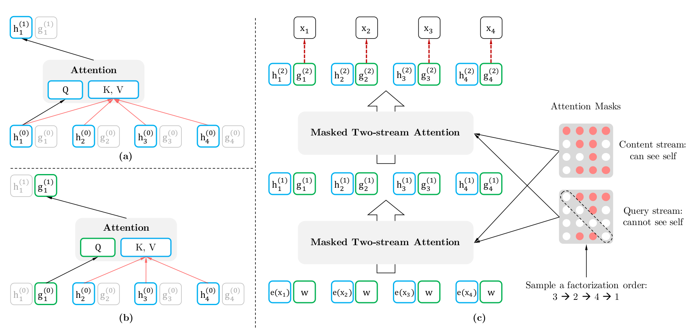

## 双流注意力
论文引用两个Stream，也就是两个隐状态：
+ 内容隐状态$h_{z_t}$，与标准Transformer一样，既编码上下文、也编码$X_{z_t}$的内容
+ 查询隐状态$g_{z_t}$，它只编码上下文和要预测的位置$z_t$，但是不包含$X_{z_t}$


## 代码分析
代码来源(pytorch版)：https://github.com/graykode/xlnet-Pytorch/blob/master/xlnet.py
``` python
def two_stream_rel_attn(self, h, g, r, mems, r_w_bias, r_r_bias, seg_mat, r_s_bias,
                            seg_embed, attn_mask_h, attn_mask_g, target_mapping):
        scale = 1 / (self.d_head ** 0.5)
        # content based attention score
        if mems is not None and len(mems.size()) > 1:
            cat = torch.cat([mems, h], dim=0)
        else:
            cat = h
        # content-based key head
        k_head_h = self.head_projection(cat, 'k')
        # content-based value head
        v_head_h = self.head_projection(cat, 'v')
        # position-based key head
        k_head_r = self.head_projection(r, 'r')
        ##### h-stream
        # content-stream query head
        q_head_h = self.head_projection(h, 'q')
        # core attention ops
        # hˆ(m)_zt = LayerNorm(h^(m-1)_zt + RelAttn(h^(m-1)_zt + [h~^(m-1), hT(m-1)_z<=t]))
        attn_vec_h = self.rel_attn_core(
            q_head_h, k_head_h, v_head_h, k_head_r, seg_embed, seg_mat, r_w_bias,
            r_r_bias, r_s_bias, attn_mask_h, scale)
        # post processing
        output_h = self.post_attention(h, attn_vec_h)
        ##### g-stream
        # query-stream query head
        q_head_g = self.head_projection(g, 'q')
        # core attention ops
        # gˆ(m)_zt = LayerNorm(g^(m-1)_zt + RelAttn(g^(m-1)_zt + [h~^(m-1), hT(m-1)_z<=t]))
        if target_mapping is not None:
            q_head_g = torch.einsum('mbnd,mlb->lbnd', q_head_g, target_mapping)
            attn_vec_g = self.rel_attn_core(
                q_head_g, k_head_h, v_head_h, k_head_r, seg_embed, seg_mat, r_w_bias, r_r_bias, r_s_bias, attn_mask_g, scale)
            attn_vec_g = torch.einsum('lbnd,mlb->mbnd', attn_vec_g, target_mapping)
        else:
            attn_vec_g = self.rel_attn_core(
                q_head_g, k_head_h, v_head_h, k_head_r, seg_embed, seg_mat, r_w_bias, r_r_bias, r_s_bias, attn_mask_g, scale)
        # post processing
        output_g = self.post_attention(g, attn_vec_g)
        return output_h, output_g
```
1. 12行，```scale = 1 / (self.d_head ** 0.5)```
self.d_head: int, 多头注意力机制中每个头的纬度， $scale=1/\sqrt{d}$

2. 13-17行，```if statement```
mem表示的前一个XLNet段的内容信息，如果mem有实际值，则将mem与当前隐向量进行拼接

3. 18-23行，```k_head_h, v_head_h, k_head_r```
``` python
def head_projection(self, h, name):
        """Project hidden states to a specific head with a 4D-shape."""
        proj_weight = None
        if name == 'q':
            proj_weight = self.q_proj_weight
        elif name == 'k':
            proj_weight = self.k_proj_weight
        elif name =='v':
            proj_weight = self.v_proj_weight
        elif name == 'r':
            proj_weight = self.r_proj_weight
        else:
            raise ValueError('Unknown `name` {}.'.format(name))
        head = torch.einsum('ibh,hnd->ibnd', h, proj_weight)
        return head
```
self.head_projection实现逻辑如上所示，用以实现将向量在Q(querry)/K(key)/V(value)/R(relative position)上的映射，由此计算得到：
+ k_head_h：h在K上的映射
+ v_head_h：h在V上的映射
+ k_head_r：相对位置编码的映射

4. 24-33行，双流注意力中的h流计算，其中：
+ q_head_h：计算h在Q上的映射
+ relative_positional_encoding：生成$R_{i-j}$
+ rel_attn_core：得到相对位置注意力分数
+ post_attention：对进行注意力计算之后的向量，进行layer_norm计算

5. 34-48行，双流注意力中的g流计算
+ 与h流计算除了多一个target_mapping，其余部分都一样。
+ target_mapping: 形状为[num_predict, len, batch_sz]，若target_mapping[i,j,k]=1, 则batch中第k个数据的第i个预测值是第j个token。
